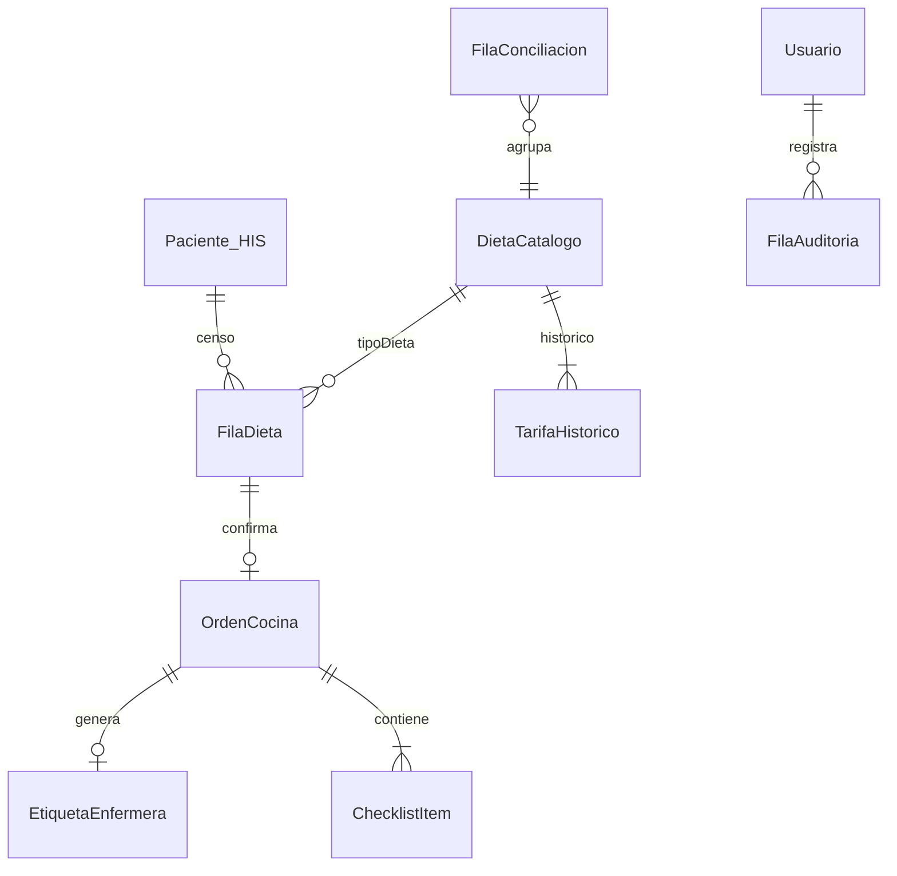
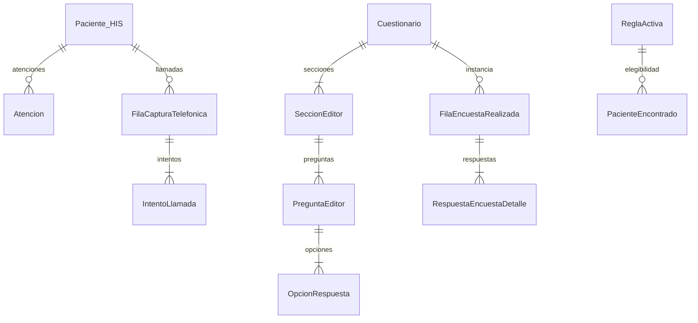

# 03 — Relaciones entre entidades

> **Alcance:** módulos Dietas y Cocina + Encuestas SIAO + tipos transversales.  
> **Convención:** cardinalidad expresada desde entidad padre → hija.  
> **Certeza:** Confirmado = evidencia en types/contextos; Inferido = recomendación backend.

---

## Diagrama general (Dietas — ciclo operativo)



**Evidencia:** `CicloBandejasContext`, `DietasOperativasContext`, `types/tray-cycle.ts`, `lib/construirConciliacionDesdeCiclo.ts`

---

## Diagrama general (Encuestas)



**Evidencia:** `types/questionnaire-editor.ts`, `types/completed-surveys.ts`, `types/capture.ts`

---

# Relaciones 1:1

| Entidad A | Entidad B | Descripción | FK / enlace | Evidencia | Certeza |
|-----------|-----------|-------------|-------------|-----------|---------|
| `FilaDieta` | `OrdenCocina` | Una fila confirmada genera como máximo una orden activa por comida/fecha | `FilaDieta.ordenCocinaId` ↔ `OrdenCocina.id` | `DietasPage`, `CicloBandejasContext.crearOrdenDesdeDieta` | Confirmado |
| `OrdenCocina` | `EtiquetaEnfermera` | Una orden produce una etiqueta logística | `OrdenCocina.etiquetaId` ↔ `EtiquetaEnfermera.id` | `generarEtiquetas` en contexto | Confirmado |
| `OrdenCocina` | `EtiquetaDieta` | Misma etiqueta en vista proveedor (sin logística) | Mismo `id` / `codigo` | `EtiquetaDieta` vs `EtiquetaEnfermera` extends | Confirmado |
| `DietaCatalogo` | `TarifaHistorico` (vigente) | Una tarifa marcada `vigente: true` por catálogo | Lógica en `resolverTarifaDieta.ts` | `catalogo.ts`, `HistoricoTarifasTimeline` | Confirmado |
| `FilaEncuestaRealizada` | `DetalleEncuestaRealizada` | Detalle expandido de listado | Mismo `id` | `DetalleEncuestaSheet` | Confirmado |
| `FilaAuditoria` | `DetalleAuditoria` | Detalle de evento auditoría Dietas | `codigoAuditoria` | `AuditoriaDetalleSheet` | Confirmado |
| `Usuario` (plataforma) | `UsuarioModulo` / `UsuarioEncuestasModulo` | Proyección por módulo del mismo usuario institucional | `UsuarioModulo.id` ≈ `Usuario.id` | Estructura paralela en tipos | Inferido |
| `Paciente` (HIS) | `PacienteEncontrado` | Vista enriquecida para encuestas | Mapeo desde `Paciente` + `Atencion` | `IdentificacionPacientePage` | Confirmado |

---

# Relaciones 1:N

| Entidad padre | Entidad hija | Cardinalidad | FK en hija | Uso frontend | Certeza |
|---------------|--------------|--------------|------------|--------------|---------|
| `Paciente` (HIS) | `Atencion` | 1:N | `Atencion.cedula` + `consecutivo` | Encuestas — historial atenciones | Confirmado |
| `Paciente` (HIS) | `FilaDieta` | 1:N | `pacienteId`, `idIngreso` | Una fila por comida/turno/día | Confirmado |
| `DietaCatalogo` | `TarifaHistorico` | 1:N | `dietaCatalogoId` (implícito en array) | Histórico tarifas | Confirmado |
| `DietaCatalogo` | `FilaDieta` | 1:N | `tipoDieta` (código/nombre) | Solicitud dieta | Confirmado |
| `OrdenCocina` | `ChecklistItem` | 1:N | Embebido en `checklist[]` | Cocina proveedor | Confirmado |
| `EstadoCicloBandejas` | `OrdenCocina` | 1:N | Agregado raíz | Persistencia ciclo | Confirmado |
| `EstadoCicloBandejas` | `EtiquetaEnfermera` | 1:N | Agregado raíz | Persistencia ciclo | Confirmado |
| `EstadoDietasPersistido` | `FilaDieta` | 1:N | Agregado raíz | Censo operativo | Confirmado |
| `ParametrosTiempoComida` | `HitoTiempo` | 1:N | Embebido `hitos[]` | Secuencia operativa | Confirmado |
| `Cuestionario` | `SeccionEditor` | 1:N | Embebido (editor) | Editor cuestionario | Confirmado |
| `SeccionEditor` | `PreguntaEditor` | 1:N | Embebido `preguntas[]` | Editor | Confirmado |
| `PreguntaEditor` | `OpcionRespuesta` | 1:N | Embebido `opciones[]` | Tipos opción | Confirmado |
| `PreguntaEditor` | `CondicionLogica` | 1:N | Embebido en `logica.condiciones[]` | Lógica condicional | Confirmado |
| `Cuestionario` | `FilaEncuestaRealizada` | 1:N | FK implícita (no en tipo listado) | Respuestas instanciadas | Inferido |
| `FilaEncuestaRealizada` | `RespuestaEncuestaDetalle` | 1:N | Embebido en detalle | Detalle encuesta | Confirmado |
| `FilaEncuestaRealizada` | `EventoHistorialEncuesta` | 1:N | Embebido `historial[]` | Trazabilidad | Confirmado |
| `FilaCapturaTelefonica` | `IntentoLlamada` | 1:N | `historialIntentos[]` | Captura telefónica | Confirmado |
| `Usuario` | `AccesoModulo` | 1:N | `accesos[]` | Auth multi-módulo | Confirmado |
| `UsuarioModulo` | `FilaAuditoria` | 1:N | `usuario.*` embebido | Auditoría Dietas | Confirmado |
| `FilaConciliacion` | `RegistroSistema` | 1:N | `registros[]` | Detalle conciliación | Confirmado |
| `DetalleAuditoria` | `EventoHistorialAuditoria` | 1:N | `historial[]` | Timeline auditoría | Confirmado |
| `Atencion` (HIS) | `PacientePresencial` | 1:N | Por fecha/servicio | Captura presencial | Inferido |
| `ReglaActiva` | Validaciones elegibilidad | 1:N reglas → N pacientes | Evaluación runtime | `PacienteEncontrado.elegible` | Inferido |

---

# Relaciones N:N

| Entidad A | Entidad B | Tabla intermedia sugerida | Descripción | Evidencia | Certeza |
|-----------|-----------|---------------------------|-------------|-----------|---------|
| `Usuario` (plataforma) | `ModuloId` | `usuario_modulo_acceso` | Usuario con rol distinto por módulo | `AccesoModulo`, `configAccesoModulos` | Confirmado |
| `RolDietas` / `RolEncuestas` | `Ruta*` (permisos) | `rol_ruta_permiso` | Matriz rol → rutas permitidas | `lib/permisos.ts`, `configAccesoModulos.ts` | Confirmado |
| `PreguntaEditor` | `Servicio` clínico | `pregunta_servicio` | `servicioAplicable` por pregunta | `PreguntaEditor.servicioAplicable` | Inferido |
| `DietaCatalogo` | `CategoriaEdad` | — (clasificación runtime) | Simulador clasifica edad → categoría | `SimuladorClasificacion`, `clasificarEdadPaciente.ts` | Confirmado (lógica, no FK) |
| `FilaDieta` | `TiempoComida` | — (atributo `comida`) | Una fila por combinación paciente+comida+fecha | `FilaDieta.comida` | Confirmado |

**Nota:** No hay N:N explícito con tabla puente en tipos actuales; las matrices de permisos y acceso por módulo son el principal caso N:N a modelar en Bital.

---

# Comportamiento al eliminar / inactivar

## Dietas y Cocina

| Entidad | Operación UI | Comportamiento actual frontend | Recomendación backend | Certeza |
|---------|--------------|-------------------------------|----------------------|---------|
| `DietaCatalogo` | Desactivar (`activa: false`) | Dialog `DesactivarDietaDialog`; no borra histórico | **Inactivación lógica**; bloquear nuevas solicitudes; mantener tarifas históricas | Confirmado |
| `TarifaHistorico` | Nueva tarifa | Marca anterior `vigente: false` | Cerrar vigencia anterior; no DELETE físico | Confirmado |
| `FilaDieta` | Cancelar | `estado: cancelada`; puede marcar `cancelacionTardia` | Soft state; conservar trazabilidad; no eliminar si hay orden | Confirmado |
| `OrdenCocina` | Cancelar | `estadoCocina: cancelada` | No DELETE si etiqueta generada; cascada estado | Confirmado (`cicloBandejasValidaciones.ts`) |
| `EtiquetaEnfermera` | Devolución | `estadoLogistica: devuelta`; no elimina registro | Conservar evidencia `fotoDevolucion` | Confirmado |
| `ChecklistItem` | — | Parte de orden; no se elimina individualmente | Actualizar `completado` únicamente | Confirmado |
| `CategoriaEdad` | Borrador | `estado: borrador` excluye de clasificación activa | Inactivación lógica | Confirmado |
| `ParametrosTiempoComida` | Desactivar comida | `activo: false` en config | No eliminar hitos; deshabilitar turno | Confirmado |
| `UsuarioModulo` | Inactivar | `estado: inactivo` | Bloquear login módulo; conservar auditoría | Confirmado |
| `FilaConciliacion` | — | Solo calculada; no CRUD | Regenerar desde ciclo; persistir cierre manual | Inferido |

### Reglas de cascada — ciclo bandejas

```text
FilaDieta (confirmada) → OrdenCocina → Etiqueta → Pre-entrega → Entrega → [Devolución]
```

| Transición | Si falla / revierte | Efecto en relaciones |
|------------|---------------------|----------------------|
| Confirmar dieta | — | Crea `OrdenCocina`; enlaza `ordenCocinaId` | Confirmado |
| Generar etiqueta | Orden debe estar `lista` o posterior | 1:1 orden-etiqueta | Confirmado |
| Despachar | Checklist obligatorio incompleto → bloqueado | No cambia cardinalidad | Confirmado |
| Cancelar dieta con orden activa | Validación en UI | **Inferido:** anular orden y etiqueta en backend | Inferido |
| Inactivar `DietaCatalogo` | Dietas ya solicitadas | Mantener referencia histórica por código/nombre | Inferido |

**Evidencia:** `lib/cicloBandejasValidaciones.ts`, `CicloBandejasContext`

---

## Encuestas SIAO

| Entidad | Operación UI | Comportamiento actual | Recomendación backend | Certeza |
|---------|--------------|----------------------|----------------------|---------|
| `Cuestionario` | Inactivar / borrador | Estados `inactivo`, `borrador` | Borrador editable; inactivo no asignable a nuevas capturas | Confirmado |
| `PreguntaEditor` | Deshabilitar | `habilitada: false` | Ocultar en captura; conservar en encuestas ya realizadas | Confirmado |
| `FilaEncuestaRealizada` | Anular | `AnularEncuestaDialog`; `estado: anulada` + `motivoAnulacion` | Soft delete; excluir de indicadores | Confirmado |
| `ReglaActiva` | Borrador | `estado: borrador` | No evaluar elegibilidad | Confirmado |
| `UsuarioEncuestasModulo` | Inactivar | `estado: inactivo` | Igual que Dietas | Confirmado |
| `Paciente` (HIS) | — | Solo lectura ApiConsultas | **Nunca eliminar desde Bital** | Confirmado |

### Integridad referencial sugerida

| Relación | ON DELETE | ON INACTIVATE |
|----------|-----------|---------------|
| `Cuestionario` → `FilaEncuestaRealizada` | RESTRICT (si completadas) | Permitir completadas históricas; bloquear nuevas |
| `PreguntaEditor` → `RespuestaEncuestaDetalle` | RESTRICT | Snapshot pregunta en respuesta (denormalizar texto) — **Inferido** |
| `Paciente` → `FilaEncuestaRealizada` | N/A (HIS) | Anonimización según política institucional — **Pendiente** |
| `ReglaActiva` → elegibilidad | N/A | Regla borrador ignorada |

---

## Transversal

| Entidad | Eliminar | Inactivar |
|---------|----------|-----------|
| `Usuario.esAdministrador` | No aplica DELETE en UI | Revocar flag; conservar registro |
| `AccesoModulo` | Quitar acceso a módulo | Equivalente a revocar rol en módulo |
| Config `bital:config-acceso-modulos` | `localStorage.removeItem` en dev | Migrar a API; versionado |

**Evidencia:** `lib/configAccesoModulos.ts`, `features/administracion/*`

---

## Resumen de políticas de borrado recomendadas

| Política | Entidades |
|----------|-----------|
| **Solo lectura externa (HIS)** | `Paciente`, `Atencion`, `AtencionHospitalaria` |
| **Inactivación lógica (`activa` / `estado`)** | `DietaCatalogo`, `UsuarioModulo`, `Cuestionario`, `ReglaActiva`, `CategoriaEdad` |
| **Máquina de estados (sin DELETE)** | `FilaDieta`, `OrdenCocina`, `EtiquetaEnfermera`, `FilaEncuestaRealizada` |
| **Histórico append-only** | `TarifaHistorico`, `FilaAuditoria*`, `IntentoLlamada`, `EventoHistorial*` |
| **Agregado recalculable** | `FilaConciliacion`, KPIs reportes/indicadores |

---

**Referencias:** `02-entidades-y-campos.md`, `07-catalogos-y-parametros.md`, `08-reglas-de-negocio.md`
