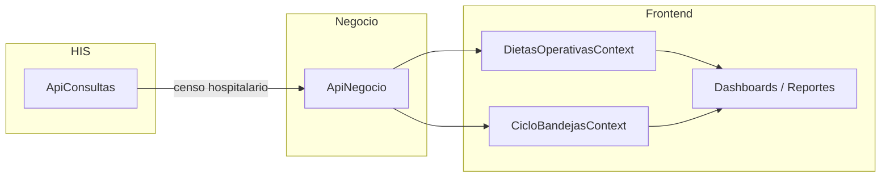

# 10 — Reportes e indicadores

> **Alcance:** Dashboards de inicio (Nutricionista, Proveedor, Enfermera), reportes operativos, KPIs de listados, indicadores del módulo Encuestas. Incluye fórmulas derivadas del código frontend y endpoints agregados sugeridos.

---

## Arquitectura de datos



**Estado actual:** Los dashboards y reportes de Dietas construyen métricas en cliente fusionando `filas` (dietas) + `ordenes` + `etiquetas` desde contextos locales. Los mocks se usan como fallback cuando no hay datos del ciclo.

---

## Dashboard Nutricionista

**Evidencia:** `inicio/dashboards/NutricionistaDashboard.tsx`, `lib/construirDashboardNutricionista.ts`, `inicio/datos/mockNutricionista.ts`

### Endpoint sugerido

```
GET /api/dietas-cocina/dashboard/nutricionista?fecha=2026-07-25&comida=almuerzo
```

### Inputs de cálculo

| Fuente | Campos usados |
|--------|---------------|
| `FilaDieta[]` | `comida`, `pacienteId`, `estado`, `cancelacionTardia`, `solicitadoEn`, `ordenCocinaId` |
| `OrdenCocina[]` | Vinculadas por `ordenCocinaId` |
| `EtiquetaEnfermera[]` | Vinculadas por `orden.etiquetaId` |
| Helpers | `estadoDietaDesdeCiclo()`, `resolverComidaOperativaActual()`, `resolverProximoCierre()` |

### KPIs

| KPI | Fórmula (código) | Variante UI |
|-----|------------------|-------------|
| Pacientes activos | `Set(filasComida.map(pacienteId)).size` | default |
| Dietas pendientes | count estado ∈ `{ no-solicitada, guardado }` | default |
| Confirmadas | count estado ∈ `{ confirmada, por-iniciar, en-preparacion, lista-despacho, despachada }` | default |
| Novedades | count `estado === guardado` | default |
| Cancelaciones | count `estado === cancelada` | alert |
| Fuera de horario | count `cancelacionTardia === true` | alert |

**Filtro base:** `filas.filter(f => f.comida === comidaOperativaActual)`.

### Distribución por estado (donut)

Agrupa `filasConEstado` por estado derivado (`estadoDietaDesdeCiclo`):

| Estado | Color hex (código) |
|--------|------------------|
| no-solicitada | `#b00020` |
| guardado | `#bbf244` |
| confirmada | `#006671` |
| por-iniciar | `#64748b` |
| en-preparacion | `#0ea5e9` |
| lista-despacho | `#00818f` |
| despachada | `#0369a1` |
| recibida | `#00818f` |
| devuelta | `#94a3b8` |
| cancelada | `#d8e0e8` |

**Total segmentos:** suma de conteos; fallback a `mockNutricionista.distribucion` si vacío.

### Tarjetas "Requiere atención"

| Título | Condición |
|--------|-----------|
| Pacientes sin dieta solicitada | `sinSolicitud = count estado no-solicitada > 0` |
| Cambios pendientes | `cambiosPendientes = count estado guardado > 0` |

### Actividad reciente

Top 5 filas con `solicitadoEn` ordenado descendente:

```
{ paciente: "habitacion / nombre", accion: accionDesdeEstado(estado), hora, estado }
```

### Próximo cierre

Desde `resolverProximoCierre(fechaReferencia)` + `pendientes` dinámico.

---

## Dashboard Proveedor

**Evidencia:** `inicio/dashboards/ProveedorDashboard.tsx`, `inicio/datos/mockProveedor.ts`, `cocina/datos/mockCocina.ts`

### Endpoint sugerido

```
GET /api/dietas-cocina/dashboard/proveedor?comida=almuerzo
```

### KPIs dinámicos (desde ciclo)

| KPI | Fórmula | Progreso |
|-----|---------|----------|
| Raciones programadas | `ordenes.length` | `(ordenes.length/total)*100` |
| En preparación | count `estadoCocina === en_preparacion` | idem |
| Listas para despacho | count `estadoCocina === lista` | idem |
| En tránsito | count `ordenEnTransito(orden, etiqueta)` | idem |

**`ordenEnTransito`:** orden despachada pendiente recepción enfermería (`cocina/lib/cocinaLogistica.ts`).

### KPIs etiquetas

| Métrica | Fórmula |
|---------|---------|
| Impresas | count `estado ∈ { impresa, reimpresa }` |
| Recibidas enfermería | count `estadoLogistica === pre_entregada` |

### Tabla órdenes turno

`ordenes.filter(o => o.comida === comidaActiva).slice(0, 6)` — columnas: paciente, dieta, estado visible, acción despacho.

### Alertas estáticas

Desde `mockProveedor.alertas` cuando no hay hallazgos dinámicos.

---

## Dashboard Enfermera

**Evidencia:** `inicio/dashboards/EnfermeraDashboard.tsx`, `lib/construirDashboardEnfermera.ts`, `inicio/datos/mockEnfermera.ts`

### Endpoint sugerido

```
GET /api/dietas-cocina/dashboard/enfermera?comida=almuerzo&pabellon=Pab.+Central
```

### Scope geográfico

```typescript
PABELLONES_ENFERMERIA = ["Pab. Central", "Pab. Norte"]
filasPiso = filas.filter(f => f.comida === comida && PABELLONES.includes(f.pabellon))
```

### KPIs

| KPI | Fórmula | Alerta |
|-----|---------|--------|
| Solicitudes pendientes | count estado ∈ `{ no-solicitada, guardado }` | — |
| Dietas confirmadas | count estados confirmados + logísticos | — |
| Novedades de hoy | count `estado === guardado` OR `(alergico && estado !== cancelada)` | `alert: novedades > 0` |

### Dietas recientes

Top 4 filas excluyendo `no-solicitada` y `cancelada`:

```
{ habitacion, paciente, tipo: tipoDieta ?? "Sin asignar", estado: derivado }
```

### Alertas clínicas (generadas)

| Trigger | Título |
|---------|--------|
| `alergico && alergias` | Alergia reportada |
| `aislado \|\| aislamiento !== "Ninguno"` | Paciente aislado |
| observaciones contiene "ayuno" o "cirugía" | Ayuno / procedimiento |

Máximo 4 alertas; fallback `mockEnfermera.alertas`.

---

## KPIs listado Dietas (`DietasKpiGrid`)

**Evidencia:** `dietas/lib/dietasEstilos.ts` → `calcularKpisDietas(filas, comidaActiva)`

Calculados en página antes de filtros secundarios (servicio/estado/búsqueda):

| KPI | Lógica típica |
|-----|---------------|
| Total pacientes | Filas comida activa |
| Pendientes solicitud | no-solicitada + guardado |
| Confirmadas | confirmada + estados cocina |
| Con alergia | alergico === true |
| Aislados | aislado o aislamiento ≠ Ninguno |

```
GET /api/dietas-cocina/dietas/kpis?comida=almuerzo
```

---

## KPIs Cocina (`CocinaKpiGrid`)

**Evidencia:** `cocina/components/CocinaKpiGrid.tsx`, `mockCocina.ts`

Conteos por `estadoCocina` y seguimiento logístico del turno activo.

```
GET /api/dietas-cocina/ordenes/kpis?comida=almuerzo
```

---

## KPIs Conciliación

**Evidencia:** `conciliacion/lib/conciliacionFiltros.ts` → `calcularKpisConciliacion(filasFiltradas)`

| KPI | Fórmula |
|-----|---------|
| Dietas registradas | `Σ cantSist` |
| Dietas facturadas | `Σ cantFact` |
| Valor calculado | `Σ (cantSist × parseMonedaCOP(tarifa))` |
| Valor facturado | `valorCalc + Σ parseDifEconomica(difEconomica)` |
| Diferencia total | `Σ parseDifEconomica(difEconomica)` |
| Inconsistencias | count `estado ∉ { coincide, conciliado-manual }` |

```
GET /api/dietas-cocina/conciliacion/kpis?periodo=2026-07&proveedor=...
```

---

## Reportes Nutricionista

**Evidencia:** `reportes/views/ReportesNutricionistaView.tsx`, `reportes/lib/reportesDesdeCiclo.ts`, `reportes/datos/mockReportesNutricionista.ts`

### Endpoint

```
GET /api/dietas-cocina/reportes/nutricionista?desde=&hasta=&servicio=&horario=
```

### Filtros (`FiltrosReportes`)

| Campo | Default |
|-------|---------|
| `desde` | Primer día mes |
| `hasta` | Hoy |
| `servicio` | `todos` |
| `horario` | `todos` |

### KPIs mock (escalados por filtros FE)

| Label | Valor base mock | Escalado |
|-------|-----------------|----------|
| Solicitadas | 4,280 | × `calcularFactor(filtros)` |
| Confirmadas | 4,150 | idem |
| Entregadas | 3,980 | idem |
| Canceladas | 130 | idem |
| Costo total | $42,800 | factor en moneda |
| Costo canc. tardía | $1,250 | idem |

**Factor filtros** (`aplicarFiltrosReportes.ts`):

```
factor = factorFechas(desde,hasta) × factorServicio(servicio) × factorHorario(horario)

factorFechas: dias = ceil((hasta-desde)/86400000)+1; clamp(dias/24, 0.35, 1.2)
factorServicio: cardiologia=0.72, pediatria=0.58, urgencias=0.85, default=1
factorHorario: desayuno=0.82, almuerzo=1, cena=0.91, default=1
```

### KPIs desde ciclo real (`construirReportesNutricionistaDesdeCiclo`)

Cuando hay órdenes/etiquetas:

| Métrica | Fuente |
|---------|--------|
| Segmentos estado | `construirSegmentosEstadoOrdenes(ordenes, getEtiqueta)` |
| Tipos dieta | `contarTiposDieta(ordenes)` — top 5 |
| Motivos devolución | `contarMotivosDevolucion(etiquetas devueltas)` |
| Distribución turno | `construirDistribucionPorTurno(ordenes)` |
| Conteos logísticos | `contarPorEstadoLogistico(etiquetas)` |

**Segmentos estado ordenes:**

| Bucket | Regla |
|--------|-------|
| En cocina | No devuelta/recibida; estado ∉ { lista, despachada } |
| Listas | `estadoCocina === lista` |
| Despachadas | `estadoCocina === despachada` (sin recepción) |
| Recibidas | logística `entregada` o `pre_entregada` |
| Devueltas | logística `devuelta` |

### Hitos temporales (SLA)

Mock base + ajuste FE:

```
minutosAjustados = max(1, round(minutos × (2 - factor × 0.5)))
```

| Etapa | Tiempo mock |
|-------|-------------|
| Conf. → Despacho | 18 min |
| Despacho → Llegada | 12 min |
| Llegada → Entrega | 8 min |
| Entrega → Recogida | 24 min |

**En backend:** calcular percentiles P50/P90 por timestamps reales de transiciones PATCH.

### Hallazgos automáticos

Desde `construirHallazgosProveedor` adaptado — ejemplos:

| Condición | Hallazgo |
|-----------|----------|
| `ordenEnTransito` > 0 | Despachos fuera de ventana |
| listas sin etiqueta impresa > 0 | Listas sin despacho |
| devueltas > umbral | Alta tasa devolución |

---

## Reportes Proveedor

**Evidencia:** `reportes/views/ReportesProveedorView.tsx`, `reportes/datos/mockReportesProveedor.ts`

### Endpoint

```
GET /api/dietas-cocina/reportes/proveedor?desde=&hasta=&servicio=&horario=
```

### KPIs operativos mock

| Label | Enfoque |
|-------|---------|
| Órdenes recibidas | Volumen turno |
| Completadas a tiempo | SLA cocina |
| Devoluciones | Calidad |
| Eficiencia impresión | Etiquetas |

### Gráficos

- Distribución por turno (6 comidas)
- Motivos devolución (top 3)
- Tipos dieta (top 5)

Misma lógica `reportesDesdeCiclo.ts` con filtro `filtrarOrdenesReporte` / `filtrarEtiquetasReporte`.

---

## Indicadores Encuestas — Experiencia

**Evidencia:** `indicadores/components/experiencia/IndicadoresExperienciaTab.tsx`, `indicadores/datos/mockIndicadoresExperiencia.ts`, `types/indicators.ts`

### Endpoint

```
GET /api/encuestas/indicadores/experiencia
  ?rango=ultimo_mes&servicio=Urgencias&puntoAtencion=...&eps=...&contrato=...&canal=...
```

### KPIs (`KpiExperienciaGrid`)

| KPI | Valor mock | Sufijo | Trend |
|-----|------------|--------|-------|
| Satisfacción Global | 87.5 | % | +2.1% ↑ |
| Recomendación IPS | 92.0 | % | +0.5% ↑ |
| Oportunidad Promedio | 18 | min | -3min ↓ |
| Cobertura Encuestas | 45 | % | nota: "1,240 pac." |

### Fórmulas sugeridas backend

| Indicador | Fórmula propuesta |
|-----------|-------------------|
| Satisfacción Global | `(count respuestas SAT ≥ satisfecho) / total respuestas escala × 100` |
| Recomendación IPS | `(promotores - detractores) / total × 100` o % "Definitivamente sí" |
| Oportunidad Promedio | `avg(timestamp fin - timestamp inicio captura)` en minutos |
| Cobertura | `encuestas completadas / pacientes elegibles × 100` |

### Gráficos

| Gráfico | Datos |
|---------|-------|
| Nivel satisfacción | Segmentos: Excelente 62%, Buena 25%, Regular 8%, Mala 3%, Muy mala 2% |
| Recomendación | Definitivamente sí 85%, Probablemente sí 10%, etc. |

```
GET /api/encuestas/indicadores/experiencia/nivel-satisfaccion
GET /api/encuestas/indicadores/experiencia/recomendacion
```

---

## Indicadores Encuestas — Brechas

**Evidencia:** `indicadores/components/brechas/AnalisisBrechasTab.tsx`, `BrechasKpiGrid.tsx`, `BrechasTabla.tsx`

### Endpoint

```
GET /api/encuestas/indicadores/brechas?servicio=&estado=&desde=&hasta=
```

### KPIs brechas (grid)

Métricas sobre `FilaBrecha[]`:

| KPI típico | Descripción |
|------------|-------------|
| Total brechas | Count filas |
| En gestión | `estado === en_gestion` |
| Pendientes | `estado === pendiente` |
| Justificadas | `estado === justificado` |
| Contacto inválido | `contacto === invalido` |

### Campos tabla para agregación

`intentos`, `motivoTono`, `contacto: valido|na|invalido`, `servicio`, `convenio`.

---

## Dashboard Inicio Encuestas

**Evidencia:** `encuestas/inicio/`, `inicio/datos/mockInicio.ts`, `KpiCard.tsx`

### Endpoint

```
GET /api/encuestas/dashboard/inicio
```

KPIs esperados: encuestas hoy, pendientes captura, SAT promedio semana, brechas abiertas (inferido de mock).

---

## SAT / NPS en encuestas realizadas

**Evidencia:** `encuestas-realizadas/components/SatNpsBadge.tsx`, `FilaEncuestaRealizada`

| Campo | Tipo | Uso |
|-------|------|-----|
| `sat` | number \| null | Escala 1–5 o porcentaje |
| `nps` | number \| null | -100 a 100 |

Agregación listado:

```
GET /api/encuestas/realizadas/resumen?desde=&hasta=
→ { satPromedio, npsPromedio, totalCompletadas, totalAnuladas }
```

---

## Mapa endpoints agregados

| Vista | Método | Endpoint |
|-------|--------|----------|
| Dashboard Nutricionista | GET | `/api/dietas-cocina/dashboard/nutricionista` |
| Dashboard Proveedor | GET | `/api/dietas-cocina/dashboard/proveedor` |
| Dashboard Enfermera | GET | `/api/dietas-cocina/dashboard/enfermera` |
| Reportes Nutricionista | GET | `/api/dietas-cocina/reportes/nutricionista` |
| Reportes Proveedor | GET | `/api/dietas-cocina/reportes/proveedor` |
| KPIs dietas listado | GET | `/api/dietas-cocina/dietas/kpis` |
| KPIs cocina | GET | `/api/dietas-cocina/ordenes/kpis` |
| KPIs conciliación | GET | `/api/dietas-cocina/conciliacion/kpis` |
| Indicadores experiencia | GET | `/api/encuestas/indicadores/experiencia` |
| Indicadores brechas | GET | `/api/encuestas/indicadores/brechas` |
| Dashboard encuestas | GET | `/api/encuestas/dashboard/inicio` |
| Resumen encuestas | GET | `/api/encuestas/realizadas/resumen` |

---

## Migración frontend → backend

| Componente | Hoy | Objetivo |
|------------|-----|----------|
| `construirDashboardNutricionistaDesdeCiclo` | Cálculo cliente | Consumir GET dashboard |
| `construirDashboardEnfermeraDesdeCiclo` | Cálculo cliente | Consumir GET dashboard |
| `ProveedorDashboard` kpisDinamicos | useMemo local | GET dashboard/proveedor |
| `aplicarFiltrosReportes` | Escala mocks | Eliminar; backend filtra |
| `reportesDesdeCiclo` | Agrega en cliente | GET reportes/* |
| `mockIndicadoresExperiencia` | Datos estáticos | GET indicadores/* |

---

## Permisos por rol (reportes)

| Rol | Dashboards | Reportes |
|-----|--------------|----------|
| Nutricionista | inicio (nutricionista) | reportes nutricionista, conciliación KPIs |
| Doctor | inicio (nutricionista) | reportes nutricionista |
| Proveedor | inicio (proveedor) | reportes proveedor |
| Enfermera | inicio (enfermera) | — |
| Administrador | todos | todos |
| Encuestador (encuestas) | inicio encuestas | indicadores lectura |

**Evidencia permisos dietas:** `lib/permisos.ts` — Proveedor: `inicio, cocina, etiquetas, reportes`; Nutricionista: incluye `reportes, conciliacion`.

---

## Notas de implementación backend

1. **Timestamps de transición:** Persistir en cada PATCH de orden/etiqueta para calcular hitos SLA reales.
2. **Comida operativa:** Centralizar lógica de `resolverComidaOperativaActual` y `resolverPeriodoOperativoNutricionista` en servidor.
3. **Idempotencia dashboards:** Respuestas cacheables por `(fecha, comida, rol)` con TTL corto (30–60s).
4. **Encuestas:** SAT/NPS deben calcularse desde respuestas normalizadas, no desde mocks.
5. **Conciliación:** KPIs deben recalcularse sobre filas filtradas server-side, no enviar todas al cliente.
